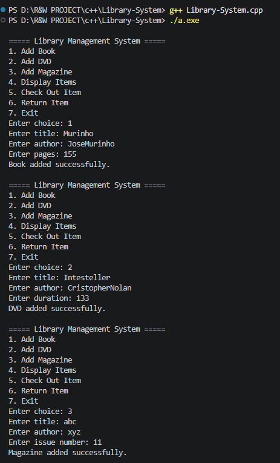
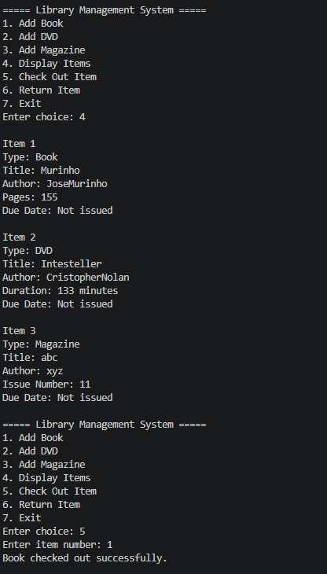

Yep. Based on your **actual final code**, here's a proper README that matches what the program really does — no fake features like search/remove/ISBN that aren't in your code.

````markdown
# 📚 Library Management System

A simple **Library Management System in C++** developed as an individual OOP project.

The project demonstrates important Object-Oriented Programming concepts including **Abstraction, Encapsulation, Inheritance, Polymorphism, Classes and Objects, Dynamic Memory Allocation, and Exception Handling**.

---

## 📌 Project Overview

The Library Management System allows users to manage different types of library items and perform basic library operations.

The system supports:

- Books
- DVDs
- Magazines
- Displaying library items
- Checking out items
- Returning items
- Exception handling
- Menu-driven interface

---

## 🛠️ Technologies Used

- **Language:** C++
- **IDE:** Visual Studio Code
- **Compiler:** GCC / G++
- **Concept:** Object-Oriented Programming

---

## 🧠 OOP Concepts Used

### 1. Abstraction

`LibraryItem` is an **abstract base class**.

It contains pure virtual functions:

```cpp
virtual void checkOut() = 0;
virtual void returnItem() = 0;
virtual void displayDetails() = 0;
````

These functions are implemented by the derived classes.

---

### 2. Encapsulation

The data members of `LibraryItem` are private:

* Title
* Author
* Due Date

Getters and setters are used to access and modify this data.

---

### 3. Inheritance

The following classes inherit from `LibraryItem`:

```text
LibraryItem
├── Book
├── DVD
└── Magazine
```

Each derived class contains its own additional information.

---

### 4. Polymorphism

The project uses a base class pointer:

```cpp
LibraryItem* libraryItems[MAX_ITEMS];
```

Different objects such as `Book`, `DVD`, and `Magazine` are stored using `LibraryItem` pointers.

The same functions:

* `checkOut()`
* `returnItem()`
* `displayDetails()`

perform different operations depending on the object type.

---

### 5. Dynamic Memory Allocation

Library items are created dynamically using `new`.

Example:

```cpp
libraryItems[count] = new Book(title, author, pages);
```

The allocated memory is released using `delete` when the program ends.

---

### 6. Exception Handling

The program uses `try`, `catch`, and exceptions to handle invalid input.

Examples include:

* Invalid menu choice
* Invalid item number
* Negative pages
* Negative duration
* Invalid issue number
* Full library
* Invalid input

---

## 📚 Library Item Types

### 📖 Book

The Book class contains:

* Title
* Author
* Pages
* Due Date

A book can be checked out and returned.

---

### 💿 DVD

The DVD class contains:

* Title
* Author
* Duration
* Due Date

A DVD can be checked out and returned.

---

### 📰 Magazine

The Magazine class contains:

* Title
* Author
* Issue Number
* Due Date

A magazine can be checked out and returned.

---

## 📋 Main Features

### Add Book

Allows the user to enter:

* Book title
* Author
* Number of pages

### Add DVD

Allows the user to enter:

* DVD title
* Author
* Duration

### Add Magazine

Allows the user to enter:

* Magazine title
* Author
* Issue number

### Display Items

Displays all currently added library items and their details.

### Check Out Item

The user can select an item by its item number and check it out.

The due date is set when the item is checked out.

### Return Item

The user can select an item and return it.

The due date is cleared after returning the item.

---

## 🖥️ Sample Output

### Output 1



### Output 2



### Output 3


---

## 📂 Project Structure

```text
Library-System/
│
├── outputs/
│   └── outputs-1.png
│
├── Library-System.cpp
├── a.exe
└── README.md
```

---

## ▶️ How to Run

### 1. Clone the Repository

```bash
git clone https://github.com/Husen77k/Library-System-C-.git
```

### 2. Open the Project

Open the project folder in **Visual Studio Code**.

### 3. Compile the Program

```bash
g++ Library-System.cpp -o Library-System
```

### 4. Run the Program

On Windows:

```bash
Library-System
```

---

## 🎯 Project Objective

The main objective of this project is to understand and implement important **Object-Oriented Programming concepts in C++** through a simple Library Management System.

The project focuses on:

* Abstraction
* Encapsulation
* Inheritance
* Polymorphism
* Dynamic Memory Allocation
* Exception Handling

---

